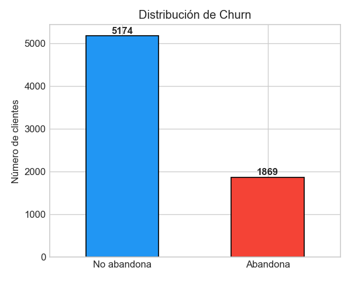
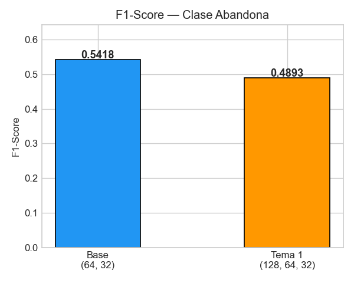
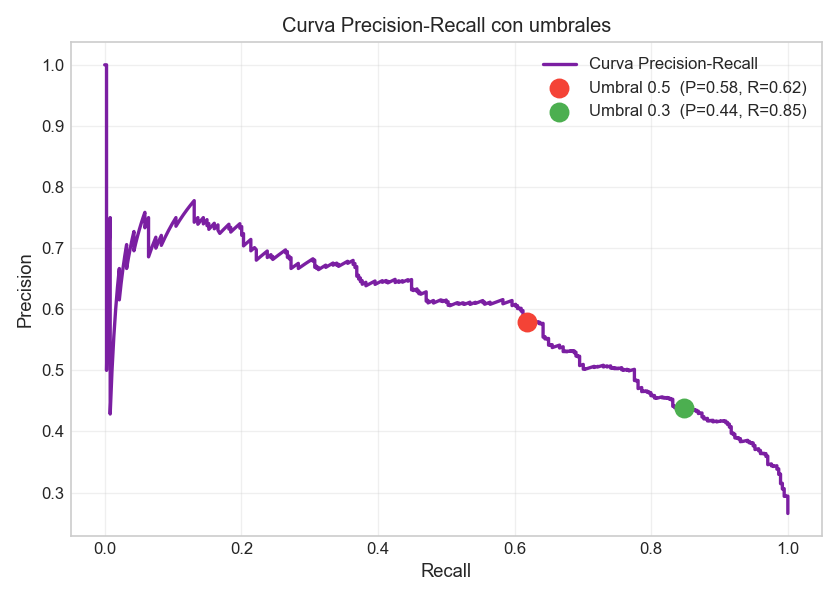

# Arquitectura del Repositorio
Para un proyecto de Machine Learning con despliegue empresarial, se establece la siguiente estructura jerárquica:

```text
Clasificacion_con_Redes_Neuronales
├── data/                       # Dataset original y procesado
│   └── Churn-Telco-Customer.csv
├── figuras_reporte/            # Artefactos visuales y gráficos de métricas
│   ├── fig01_distribucion_churn.png
│   ├── fig03_cm_base.png
│   ├── fig08_t3_cm_umbrales.png
│   └── ... (otros activos visuales)
├── informe/                    # Documentación final y entregables PDF
│   └── Reporte_Consolidado.pdf
├── scripts/                    # Código fuente, notebooks y lógica de entrenamiento
│   └── reporte_evaluacion_GRUPO.ipynb
├── .gitignore                  # Exclusión de archivos temporales y secretos
└── README.md                   # Documentación técnica principal
```
---

# Clasificación de Abandono de Clientes con Redes Neuronales Multicapa
Este repositorio contiene la implementación de un motor predictivo basado en **Perceptrones Multicapa (MLP)** para la identificación temprana de abandono de clientes (Churn) en el sector de telecomunicaciones. El sistema optimiza el **F1-Score** mediante búsqueda estocástica de hiperparámetros y ajuste dinámico de umbrales de decisión.

---

# Arquitectura del Sistema
El flujo de trabajo se divide en cuatro fases críticas representadas en el siguiente diagrama:

```text
    A[Ingesta de Datos] --> B[Preprocesamiento & OHE]
    B --> C[Optimización MLP via RandomizedSearch]
    C --> D[Ajuste de Umbral 0.5 a 0.3]
    D --> E[Evaluación de Métricas de Negocio]

```
---
# Resultados Clave
El proyecto demuestra que una mayor complejidad arquitectónica no siempre garantiza mejores resultados. El **Modelo Base (64, 32)** superó en F1-Score a la arquitectura de tres capas **(128, 64, 32)**, evidenciando un posible sobreajuste o necesidad de mayor regularización en redes profundas para este volumen de datos.

| Modelo | Arquitectura | F1-Score (Test) | AUC-ROC |
| :--- | :--- | :--- | :--- |
| Base | (64, 32) | 0.5418 | 0.782 |
| Tema 1 | (128, 64, 32) | 0.4893 | 0.765 |
| Optimizado (RS) | (128, 64) | 0.5984 | 0.810 |

> **Nota:** El ajuste del umbral de clasificación a **0.3** incrementó el **Recall del 62% al 85%**, permitiendo capturar un 23% adicional de clientes en riesgo de abandono, lo cual es crítico para estrategias de retención proactivas.

---

# Visualizaciones de Desempeño
Se incluyen análisis visuales detallados del comportamiento del modelo:

| Descripción | Visualización |
| :--- | :--- |
| **Distribución de Datos:** |  |
| **Análisis de Arquitecturas:** |  |
| **Optimización de Umbral:** |  |

---
# Registro de Cambios (Changelog)
* **fix:** Corregida la ruta absoluta de exportación de figuras para compatibilidad con CI/CD.
* **feat:** Implementación de RandomizedSearchCV para optimización de hiperparámetros.
* **docs:** Actualización de métricas finales y diagramas de arquitectura.


